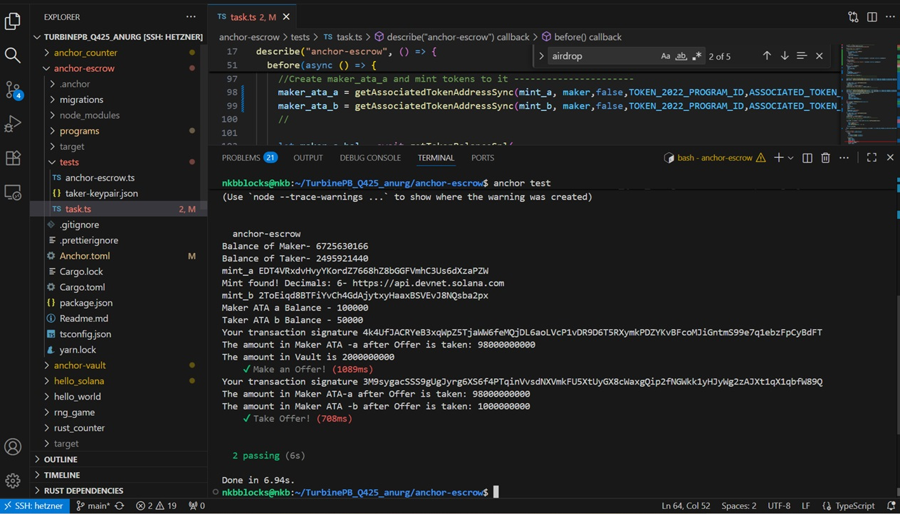

##### Solana Escrow

This repo contains Solana Escrow example.

##### Task2 (Part-3)

##### ✔ Make an Offer! (1089ms)
https://explorer.solana.com/tx/4k4UfJACRYeB3xqWpZ5TjaWW6feMQjDL6aoLVcP1vDR9D6T5RXymkPDZYKvBFcoMJiGntmS99e7q1ebzFpCyBdFT?cluster=devnet

 #### ✔ Take Offer! (708ms)
https://explorer.solana.com/tx/3M9sygacSSS9gUgJyrg6XS6f4PTqinVvsdNXVmkFU5XtUyGX8cWaxgQip2fNGWkk1yHJyWg2zAJXt1qX1qbfW89Q?cluster=devnet


#### Clone the Repo and change directory to token-mint

```
git clone https://github.com/anurg/TurbinePB_Q425_anurg.git
cd anchor-escrow
```

##### Sync Keys

```
anchor keys sync
```

##### Build Project

```
anchor build
```

##### Run test

```
anchor test
```
