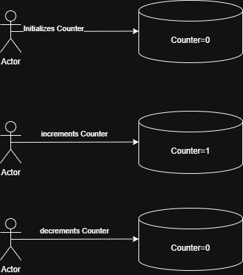

#### Counter Program User Stories

#### User Story-1

- As a User I want to create a Counter with start value 0.
  Acceptance Criterion
- User is able to create Counter by Paying transaction Fees.

#### User Story-2

- As a User I want to increment the counter by 1.
  Acceptance Criterion
- User is able to increment the Counter.

#### User Story-3

- As a User, I want to decrement the counter by 1.
  Acceptance Criterion
- User is able to Decrement the Counter.

#### Architecture Diagram

##### Running the Code
