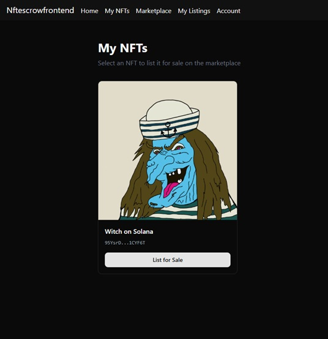
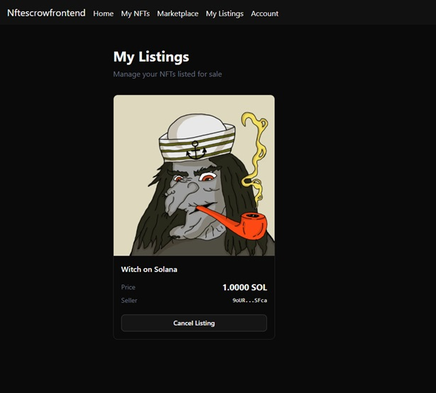
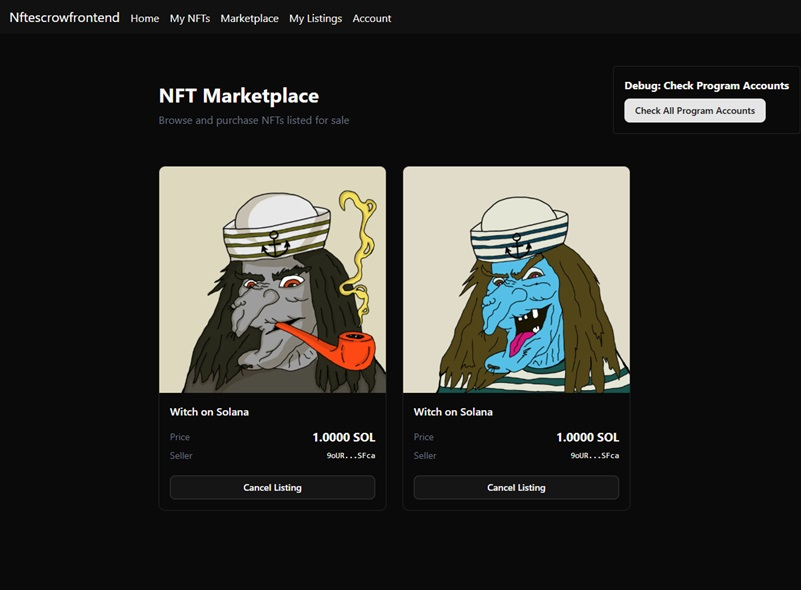

#### nft-escrow
This Solana Program project (Deployed on devnet) allows user to trade NFT's for lamports in trustless way.
User can lock the NFT in Escrow and specify the amount of lamports required for NFT.
Buyer can connect their wallet and get the NFT by paying required lamports.

##### Program Address on Solana Devnet
https://explorer.solana.com/address/GtgieiJUb3cCJ1xm7s1Vc6JU8PKe6GiGmTiA13KYcnK7?cluster=devnet 

#### Frontend (Developed Using Claude Code)
Here is the frontend for the same deployed on Vercel (Solana Devnet)
https://nft-escrow-frontend-v2rw.vercel.app/ 

##### My NFT Page

##### My Listings Page

##### NFT Marketplace Page
