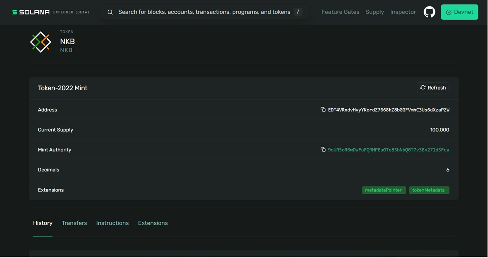

##### Instrcutions to Mint new Token with Name, Symbol, and other metadata

#### Clone the Repo and change directory to token-mint

```
git clone https://github.com/anurg/TurbinePB_Q425_anurg.git
cd token-mint
```

##### Install dependencies

```
npm install
```

##### Change the following as per your Token metadata

```
name:"NKB",
    symbol:"NKB",
    uri:"https://raw.githubusercontent.com/anurg/TurbinePB_Q425_anurg/refs/heads/main/nkb.json",
    additionalMetadata:[["description","Everything Crypto"]],
```

##### Token Image

Inside the json file , you can give URL of Image

```
{
    "name": "NKB",
    "symbol": "NKB",
    "description": "Everything Crypto!",
    "image": "https://www.nkbblocks.com/images/logo.png",
    "attributes": [
        {
            "trait_type": "Item",
            "value": "Developer Portal"
        }
    ]
}
```

##### Run the ts file

```
npx ts-node src/spl_with_metadata.ts
```

##### Task 2 (Part 1)


- Mint Address
https://explorer.solana.com/address/EDT4VRxdvHvyYKordZ7668hZ8bGGFVmhC3Us6dXzaPZW?cluster=devnet

- Mint Tx
https://explorer.solana.com/tx/3d6EJKFAue1EJmJ7CwWVTHc3Tps7zYLJpJ535ZSJg1p12nwmSqtGUehjbrUM4pHMkdtXnriqAM7uQyKSVF7n2eCd?cluster=devnet


###### Mint token to Wallet
https://explorer.solana.com/tx/2AiLQSWyCrJhEYtWiW6cBrYu8nzHhnGNwDLSY4yRHQnTpkuDCjbxgpPhjDzSsirLoZcBh1zascAWqMsoCB5sCCUE?cluster=devnet
