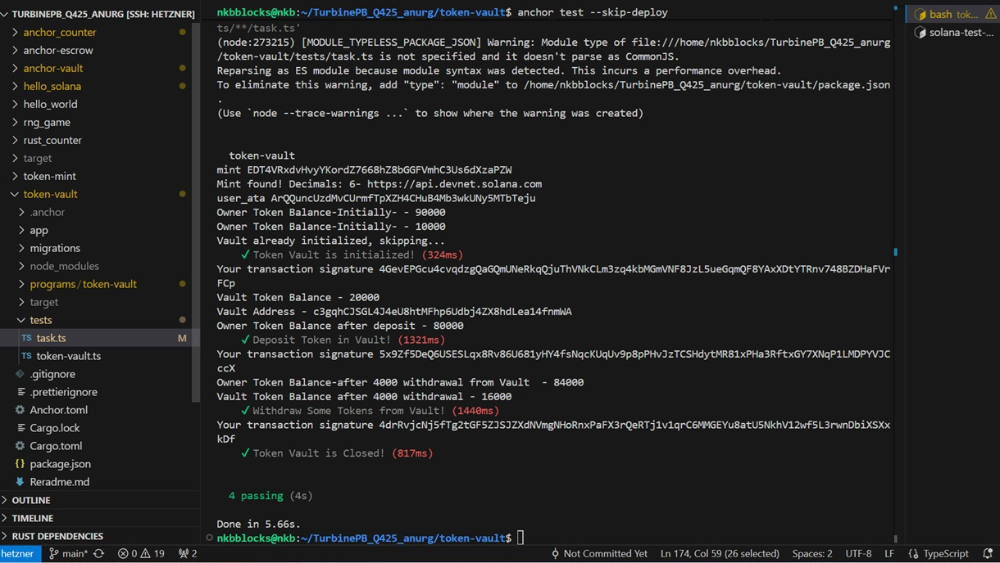

##### Token Vault

This repo contains Solana Vault example to store SPL Tokens. User can deposit & withdraw the  Tokens in vault.

##### Task2 (Part-2)


- Token Created in Minting Task
https://explorer.solana.com/address/EDT4VRxdvHvyYKordZ7668hZ8bGGFVmhC3Us6dXzaPZW?cluster=devnet

- Vault Account
https://explorer.solana.com/address/c3gqhCJSGL4J4eU8htMFhp6Udbj4ZX8hdLea14fnmWA?cluster=devnet

- Token Deposit in Vault txn
https://explorer.solana.com/tx/5x9Zf5DeQ6USESLqx8Rv86U681yHY4fsNqcKUqUv9p8pPHvJzTCSHdytMR81xPHa3RftxGY7XNqP1LMDPYVJCccX?cluster=devnet


#### Clone the Repo and change directory to token-mint

```
git clone https://github.com/anurg/TurbinePB_Q425_anurg.git
cd token-vault
```

##### Sync Keys

```
anchor keys sync
```

##### Build Project

```
anchor build
```

##### Run test

```
anchor test
```
